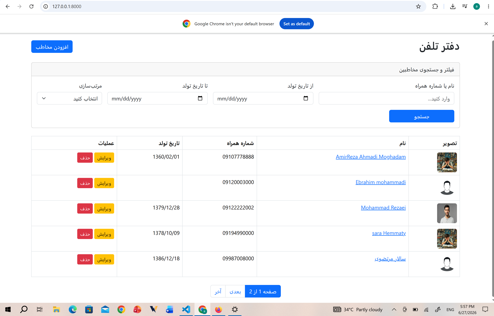

# 📒 Phonebook Web Application (Django + MySQL)

A simple backend-focused Phonebook application built with Django that demonstrates CRUD operations with MySQL integration.

---

## 🚀 Features

- Add new contacts
- Edit existing contacts
- Delete contacts
- Search contacts by name or phone number
- View all contacts
- Django admin panel support

---

## 🛠 Tech Stack

- Python 3.x
- Django
- MySQL
- HTML / CSS

---

## 🗄 Database Configuration (MySQL)

This project uses MySQL as the main database.

Add this in `settings.py`:

```python
DATABASES = {
    'default': {
        'ENGINE': 'django.db.backends.mysql',
        'NAME': 'your_db_name',
        'USER': 'your_user',
        'PASSWORD': 'your_password',
        'HOST': 'localhost',
        'PORT': '3306',
    }
}
```

---

## ⚙️ Setup

- git clone https://github.com/amirmolla-dev/phonebook.git

- cd phonebook

- python -m venv venv

- venv\Scripts\activate   # Windows

- pip install django mysqlclient

- python manage.py migrate

- python manage.py runserver

---

## 📸 Project Preview


